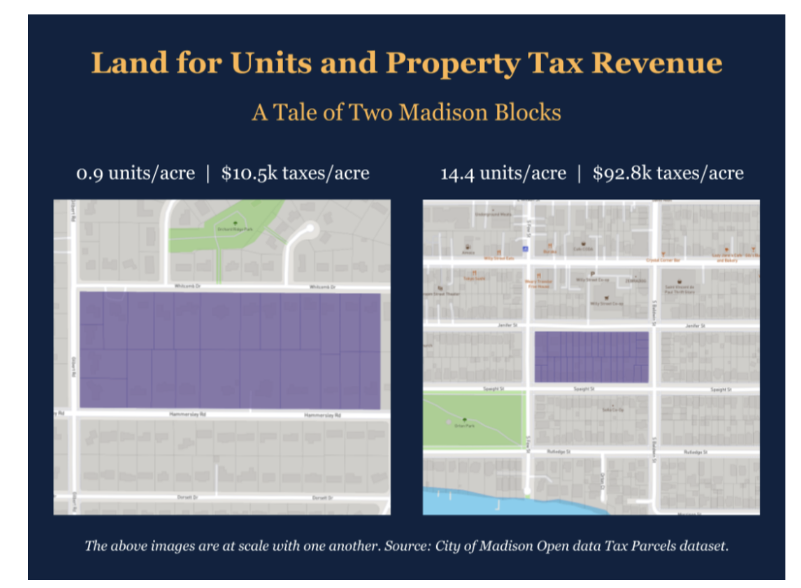

# `r paste0(district, ": ", x)`

## Introduce yourself

### `r responses$question[1]`
_`r paste0(x, " (", district_short, "):")`_ `r responses$answer[1]`

### `r responses$question[2]`
_`r paste0(x, " (", district_short, "):")`_ `r responses$answer[2]`

### `r responses$question[3]`
_`r paste0(x, " (", district_short, "):")`_ `r responses$answer[3]`

## Zoning and Land Use

**Question: `r responses$question[4]` **

_`r paste0(x, " (", district_short, "):")`_ `r responses$answer[4]`

<!--  -->
lorem_strong

**Question: `r responses$question[5]` **

_`r paste0(x, " (", district_short, "):")`_ `r responses$answer[5]`

## Housing Affordability

**Question: `r responses$question[6]` **

_`r paste0(x, " (", district_short, "):")`_ `r responses$answer[6]`

**Question: `r responses$question[7]` **

_`r paste0(x, " (", district_short, "):")`_ `r responses$answer[7]`

**Question: `r responses$question[8]` **

_`r paste0(x, " (", district_short, "):")`_ `r responses$answer[8]`

**Question: `r responses$question[9]` **

_`r paste0(x, " (", district_short, "):")`_ `r responses$answer[9]`

## Transportation, Safety, and Climate

**Question: `r responses$question[10]` **

_`r paste0(x, " (", district_short, "):")`_ `r responses$answer[10]`

**Question: `r responses$question[11]` **

_`r paste0(x, " (", district_short, "):")`_ `r responses$answer[11]`

**Question: `r responses$question[12]` **

_`r paste0(x, " (", district_short, "):")`_ `r responses$answer[12]`

**Question: `r responses$question[13]` **

_`r paste0(x, " (", district_short, "):")`_ `r responses$answer[13]`

<!--  -->
lorem_wilson
**Question: `r responses$question[14]` **

_`r paste0(x, " (", district_short, "):")`_ `r responses$answer[14]`

[top of page](#top)